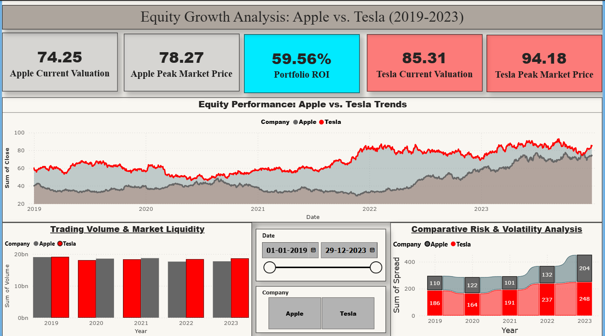

# 📈 Stock Market Analysis — Apple vs Tesla (2019–2023)

**Tools:** MySQL · Power BI · DAX  
**Result:** Apple 85.6% ROI vs Tesla 42.2% ROI

## 📌 Project Goal
Compare Apple and Tesla stock performance over 5 years to determine which offered better returns and which carried more risk.

## 🗂️ Files in This Repository
| File | Description |
|------|-------------|
| `stockmarket_project.sql` | Database creation, data import, and all analysis queries |
| `stockmarket_project.csv` | Raw historical stock data (2019–2023) |
| `dashboard_preview.png` | Power BI dashboard screenshot |

## 🔍 Key Insights
- **Growth:** Apple grew 85.6% vs Tesla's 42.2% over the period
- **Risk:** Tesla showed higher daily volatility (shakier price line)
- **Liquidity:** Tesla had significantly higher average trading volume

## 🛠️ How to Run
1. Install MySQL and enable `local_infile`
2. Update the CSV path in the SQL file to your local path
3. Run `stockmarket_project.sql` in MySQL Workbench
4. Open `stockmarket_project.pbix` in Power BI Desktop

## 📊 Dashboard Preview

